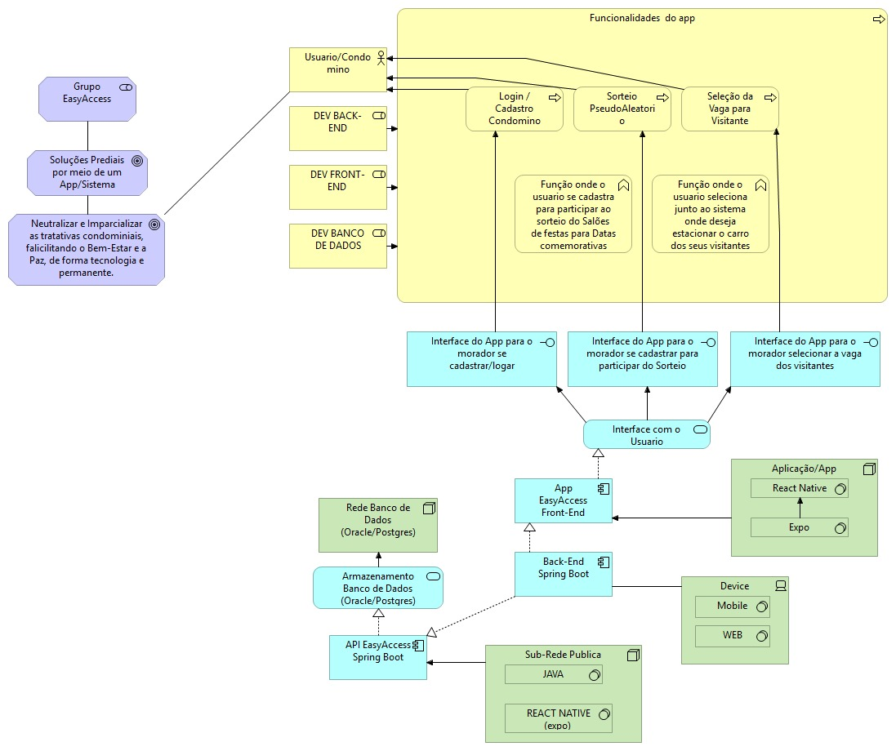
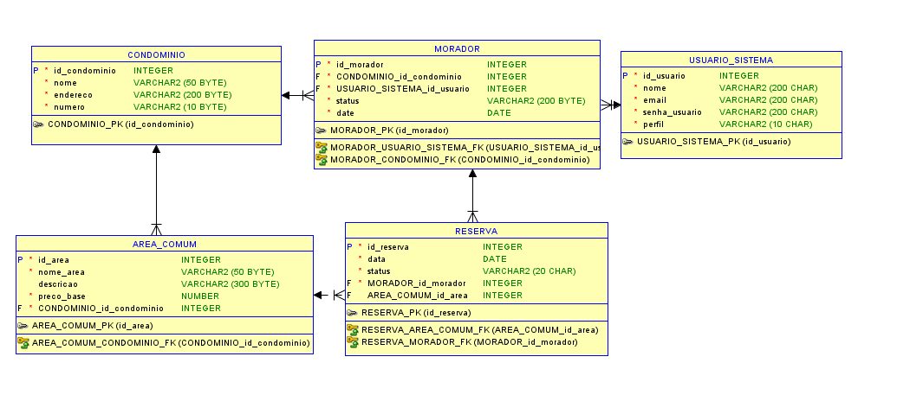
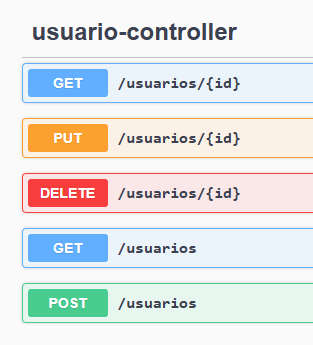
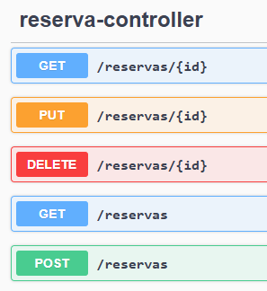
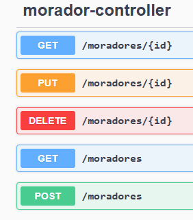
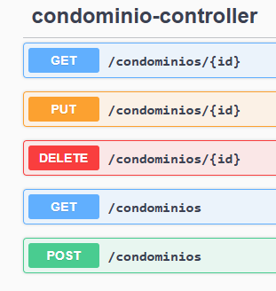
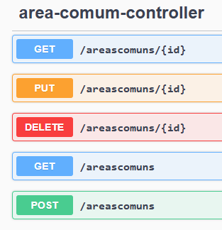

# EasyAccess

Sistema de agendamento e gerenciamento de áreas comuns para condomínios residenciais.

## Integrantes
Daniel K S Araki - 553043 - Responsável por Java e Banco de Dados

Jonas K Isiki - 560560 - Responsável por IOT e Mobile

Marcos V A Marques - 560475 - Responsável por Quality Assurence e DevOps

## Público Alvo
- Condomínios Residenciais com áreas comuns
- Moradores e Inquilinos

## Soluções do projeto
- Otimização e simplificação do processos de agendamento e gestão de áreas comuns

## Arquitetura do sistema

## Diagrama Entidade Relacionamento

## Listagem dos Endpoints

### Usuário

### Reserva

### Morador

### Condomínio

### Área Comum

## Link do vídeo

https://youtu.be/jz47xXI2RmY

## Como executar
1. Navegar até o arquivo EasyaccessApplication

2. Executar o arquivo

3. Acessar `http://localhost:8080` no navegador.