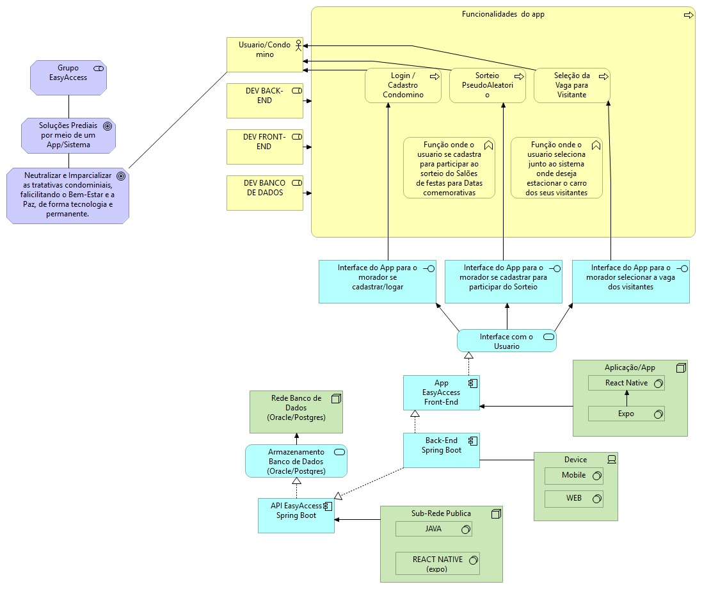
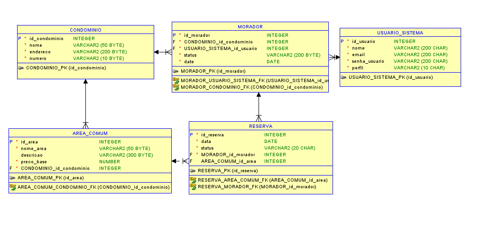
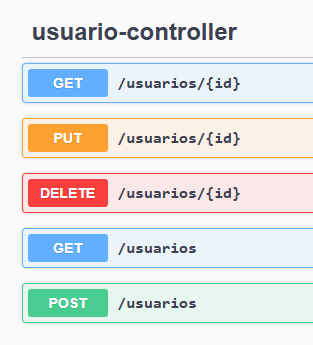
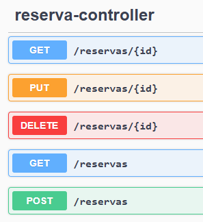
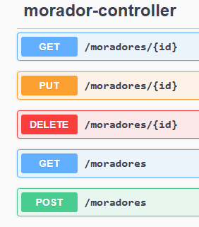
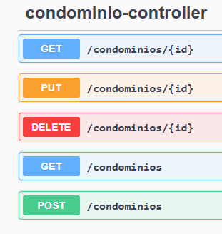
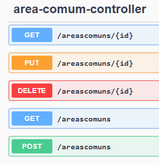

# EasyAccess

Sistema de agendamento e gerenciamento de áreas comuns para condomínios residenciais.

## Integrantes

| Nome | RM | Responsabilidade |
|---|---|---|
| Daniel K S Araki | 553043 | Java e Banco de Dados |
| Jonas K Isiki | 560560 | IOT e Mobile |
| Marcos V A Marques | 560475 | Quality Assurance e DevOps |

## Público Alvo

- Condomínios residenciais com áreas comuns
- Moradores e inquilinos

## Soluções do Projeto

- Otimização e simplificação dos processos de agendamento e gestão de áreas comuns em condomínios

## Arquitetura do Sistema



## Diagrama Entidade Relacionamento



---

## Pré-requisitos

Antes de executar o projeto, certifique-se de ter instalado:

- **Java 21** ou superior ([Download](https://www.oracle.com/java/technologies/downloads/))
- **Git** ([Download](https://git-scm.com/downloads))
- Acesso à **rede FIAP** (para conexão com o banco de dados Oracle) ou VPN equivalente

> As dependências do projeto são gerenciadas pelo **Gradle Wrapper** (`gradlew`), que já está incluído no repositório — não é necessário instalar o Gradle separadamente.

---

## Instalação

### 1. Clonar o repositório

```bash
git clone https://github.com/<seu-usuario>/easyaccess.git
cd easyaccess
```

### 2. Configurar variáveis de ambiente

Crie um arquivo `.env` na raiz do projeto com o seguinte conteúdo:

```env
# Banco de Dados Oracle
DB_URL=jdbc:oracle:thin:@//oracle.fiap.com.br:1521/ORCL
DB_USER=<seu_rm>
DB_PASS=<sua_senha>

# RabbitMQ (CloudAMQP)
RABBITMQ_HOST=<host_cloudamqp>
RABBITMQ_USERNAME=<usuario_cloudamqp>
RABBITMQ_PASSWORD=<senha_cloudamqp>
RABBITMQ_VHOST=<vhost_cloudamqp>
```

> **Atenção:** Nunca versione o arquivo `.env` com credenciais reais. Ele já está listado no `.gitignore`.

### 3. Configurar o Firebase

O projeto utiliza o Firebase para autenticação. Adicione o arquivo de credenciais do Firebase (`serviceAccountKey.json` ou equivalente) no caminho configurado em `FirebaseConfig.java`, geralmente:

```
src/main/resources/firebase-service-account.json
```

---

## Execução

### Via linha de comando (recomendado)

No diretório raiz do projeto, execute:

**Linux / macOS:**
```bash
./gradlew bootRun
```

**Windows:**
```cmd
gradlew.bat bootRun
```

### Via IDE (IntelliJ IDEA)

1. Abra o projeto no IntelliJ IDEA
2. Aguarde o Gradle sincronizar as dependências
3. Navegue até `src/main/java/br/com/easyaccess/easyaccess/EasyaccessApplication.java`
4. Clique no botão **Run** (▶) ao lado da classe ou pressione `Shift + F10`

---

## Acesso à Aplicação

Após iniciar a aplicação, ela estará disponível em:

```
http://localhost:8080
```

### Documentação interativa (Swagger UI)

A documentação completa dos endpoints pode ser acessada em:

```
http://localhost:8080/swagger-ui/index.html
```

> O Swagger UI está disponível publicamente e não exige autenticação.

---

## Autenticação

A API utiliza **Firebase Authentication** com tokens JWT. Para acessar os endpoints protegidos:

1. Obtenha um **token Firebase** autenticando-se pelo aplicativo mobile ou pelo console do Firebase
2. Inclua o token no cabeçalho de todas as requisições:

```
Authorization: Bearer <firebase_token>
```

### Perfis de acesso

| Role | Permissões |
|---|---|
| `ADMIN` | Acesso total: condôminos, áreas comuns, reservas, moradores |
| `MORADOR` | Acesso a reservas e moradores |
| Público | `POST /usuarios` e documentação Swagger |

> **Criar um usuário:** `POST /usuarios` é o único endpoint aberto sem autenticação. Após criar o usuário, utilize o Firebase para obter o token de acesso.

---

## Endpoints Disponíveis

### Usuário


### Reserva


### Morador


### Condomínio


### Área Comum


---

## Tecnologias Utilizadas

- **Java 21**
- **Spring Boot 3.5.6**
- **Spring Security** com Firebase Auth
- **Spring Data JPA** + **Oracle Database**
- **RabbitMQ** (via CloudAMQP) para mensageria
- **Spring Cloud OpenFeign** para clientes HTTP
- **Springdoc OpenAPI (Swagger UI)**
- **Gradle 8**

---

## Vídeo de Demonstração

[Assista no YouTube](https://youtu.be/g64cDtev5bY)